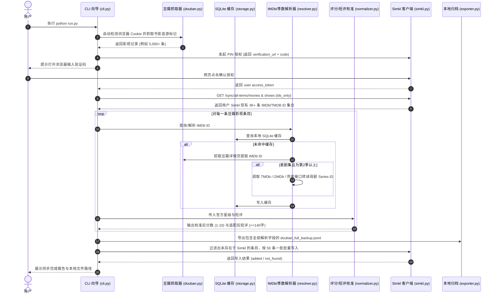

# douban2simkl 系统架构与技术设计文档

**文档日期**：2026-10-01  
**状态**：待评审 (Draft)  
**作者**：Antigravity & User  

---

## 1. 项目愿景与目标

构建一个开箱即用、无缝体验的开源 CLI 工具 **`douban2simkl`**。任何豆瓣用户只需运行一条命令，即可将自己所有的电影、电视剧记录（包含“看过”、“想看”、“在看”、评分、观影日期、短评）智能、增量、无损地同步到 Simkl。

### 核心特性
1. **零配置自动抓取**：默认自动读取本机主流浏览器 Cookie（Chrome / Edge / Firefox / Brave 等）在线抓取最新豆瓣数据，无需手动登录或填写配置。
2. **全量本地归档**：无论是否推送到 Simkl，任务结束后均在本地输出一份结构完整、包含转译元数据的 `douban_full_backup.jsonl`，确保用户数字资产完整。
3. **精准评分校准引擎**：自动识别短评中隐藏的半星打分（如 `3.5`、`4.5`、`2.5`、`1.5`、`三星半` 等），在 Simkl 的 1~10 分制下完美还原用户的真实评级（例如 3.5星 $\rightarrow$ 7分）。
4. **剧集多季智能转译**：智能识别 TV 剧集的季数（第 2 季等），将豆瓣页面抓取到的单集/分季 IMDb ID 转换为母剧的 **Series IMDb ID**，支持配置可选的 TMDb / OMDb API Key，并配备免 Key 的公网兜底。
5. **智能差量去重**：同步前自动拉取用户 Simkl 现有全部影视库建立索引，毫秒级跳过重复项，仅增量推送未收录数据。
6. **Simkl 极简授权**：通过 Simkl 官方 PIN 设备流，终端给出网址与验证码，用户在浏览器一键点击授权，免去手动注册开发者应用的繁琐流程。

---

## 2. 整体架构与模块设计

系统位于工作区根目录，分为以下核心模块：

```
douban2simkl/
├── douban2simkl/
│   ├── __init__.py
│   ├── config.py          # 配置管理 (.env 与默认参数)
│   ├── douban.py          # 豆瓣读取器 (自动读浏览器Cookie + 移动端Rexxar抓取)
│   ├── resolver.py        # IMDb ID 解析器与 TV 多季母剧转译引擎
│   ├── normalizer.py      # 评分校准引擎 (半星识别) 与短评140字适配
│   ├── simkl.py           # Simkl API 客户端 (PIN授权 / 差量拉取 / 批量推送)
│   ├── storage.py         # 本地 SQLite 持久化缓存与断点续传
│   ├── exporter.py        # 本地全量数据与长评归档导出器
│   └── cli.py             # 终端交互界面 (基于 Rich 的彩色进度与向导)
├── run.py                 # 一键启动脚本
├── pyproject.toml         # 依赖配置
├── .env.example           # 可选配置模板 (TMDb Key / 独立Simkl Key等)
└── README.md              # 面向大众用户的说明文档
```

---

## 3. 详细处理流程与关键逻辑



---

## 4. 关键技术细节实现方案

### 4.1 豆瓣数据读取（`douban.py`）
- 优先调用 `browser_cookie3` 扫描 Chrome, Edge, Firefox, Brave, Safari 的 `.douban.com` Cookie。
- 提取 `ck` 与 `dbcl2`，向 `https://m.douban.com/rexxar/api/v2/user/{uid}/interests?type=movie&status={mark|doing|done}` 发起分页请求。
- 内置请求节流（默认 1.0s），遇 HTTP 500 自动降级为单条容错抓取。

### 4.2 评分校准引擎（`normalizer.py`）
针对豆瓣不支持半星、用户在短评中手写半星的痛点：
1. **正则识别**：
   - 匹配短评中出现的 `1.5`、`2.5`、`3.5`、`4.5` 或汉字 `一星半`、`二星半`、`三星半`、`四星半`。
   - 过滤排除包含时间或尺寸单位的干扰词（如 `小时`、`h`、`寸`、`mm`、`岁`、`号` 等）。
2. **打分换算规则**：
   - 命中 `3.5` $\rightarrow$ Simkl 记为 **7 分**；
   - 命中 `4.5` $\rightarrow$ Simkl 记为 **9 分**；
   - 命中 `2.5` $\rightarrow$ Simkl 记为 **5 分**；
   - 命中 `1.5` $\rightarrow$ Simkl 记为 **3 分**；
   - 未命中短评打分：以官方星级 $\times 2$ 换算（1~5星 $\rightarrow$ 2, 4, 6, 8, 10）；
   - 官方未评分且短评未打分：留空。

### 4.3 短评与长评处理（`normalizer.py` & `exporter.py`）
- **Simkl 字符限制**：Simkl API 的 `memo.text` 字段上限为 140 字符。
- **自适应逻辑**：
  - $\le 140$ 字符：直接写入 Simkl Memo。
  - $> 140$ 字符：截取前 137 字并追加 `...` 写入 Simkl Memo。
  - 所有 $> 140$ 字符的长评，自动追加导出至本地 `long_reviews_archive.md`，包含条目名称、年份、完整文字、豆瓣链接。

### 4.4 IMDb 与多季剧集母剧转译（`resolver.py`）
1. **单项解析**：
   通过移动端简介接口 `https://www.douban.com/doubanapp/h5/movie/{id}/desc` 提取 `<td>IMDb</td><td>(tt\d+)</td>`。
2. **多季剧集处理（Season 2+）**：
   - 从标题匹配季数正则：`第([一二三四五六七八九十\d]+)季|Season\s*(\d+)`。
   - 豆瓣给出的 IMDb ID 通常为该季第 1 集。
   - **转译策略**：
     - **优先方案（如果配置了 TMDB_API_KEY）**：
       调用 TMDb `GET /3/find/{imdb_id}?external_source=imdb_id`，获得 `tv_episode_results[0].show_id` 与 `season_number`；再查询 show 详情拿到母剧的 Series IMDb ID。
     - **备选方案（如果配置了 OMDB_API_KEY）**：
       调用 OMDb `GET /?i={imdb_id}`，直接读取响应中的 `seriesID` 与 `Season`。
     - **免 Key 公网兜底**：
       调用 Cinemeta 元数据接口 `https://v3-cinemeta.strem.io/meta` 或从标题提取主剧名在本地/公网做联动索引。
3. **Simkl 载荷组装**：
   对多季剧集，构造全季标记载荷：
   ```json
   {
     "shows": [
       {
         "ids": { "imdb": "tt_series_id" },
         "seasons": [{ "number": season_number }],
         "watched_at": "...",
         "rating": 7,
         "memo": { "text": "...", "is_private": false }
       }
     ]
   }
   ```

### 4.5 本地全量归档导出（`exporter.py`）
无论网络推送成功与否，任务均导出 `douban_full_backup.jsonl`，每行一个 JSON 对象，结构规范：
```json
{
  "douban_id": "1292052",
  "title": "肖申克的救赎",
  "original_title": "The Shawshank Redemption",
  "year": 1994,
  "type": "movie",
  "status": "done",
  "create_time": "2016-07-20 08:58:26",
  "official_rating": 5,
  "calibrated_rating": 10,
  "rating_source": "official",
  "imdb_id": "tt0111161",
  "series_imdb_id": null,
  "season": null,
  "comment": "这是一部伟大的电影...",
  "memo_synced": "这是一部伟大的电影...",
  "simkl_sync_status": "synced"
}
```

---

## 5. 用户操作向导规划

```text
============================================================
              douban2simkl 一站式全量同步工具
============================================================

[1/3] 正在从本机浏览器自动读取豆瓣账号...
  ✔ 检测到 Chrome 浏览器登录会话 (用户: @Barba)
  ✔ 正在在线拉取豆瓣影视记录... [5,006 / 5,006] 完成！

[2/3] 连接 Simkl 账号
  请用浏览器打开以下网址完成授权:
  👉 https://simkl.com/pin
  并在页面中输入验证码: [ J7K9-MN2P ]
  (等待网页授权中...) 
  ✔ 授权成功！已绑定 Simkl 用户: @Barba

[3/3] 数据比对与增量同步
  • 豆瓣总影视数: 5,006
  • Simkl 现存影视: 3,215 (已建立去重索引)
  • 待同步差量数: 1,791
  • 识别并校准半星评分: 878 部
  • 配置外部 API Key: [已检测到 TMDB_API_KEY] (高精度剧集母剧转译已启用)

  正在同步 [━━━━━━━━━━━━━━━━━━━━━━━━━━━━━━━━━━━━━━━━] 100% 1,791/1,791
  
✔ 同步全部顺利完成！
📁 全量数据备份已存至: ./douban_full_backup.jsonl
📁 长评归档已存至: ./long_reviews_archive.md
📁 详细执行报告已生成: ./sync_report.md
```

---

## 6. 验证与测试方案
1. **单元测试与集成测试**：
   - 测试 `normalizer.py` 对 878 种半星短评的正则覆盖度，确保无负面回退。
   - 测试 `resolver.py` 对单集 IMDb ID 到 Series ID 的转译准确度。
   - 测试 `simkl.py` 的 batching（50/chunk）切片与差量去重集合计算。
2. **试运行（Dry-run 模式）**：
   - 增加 `--dry-run` 选项，支持用户在真正往 Simkl 写入数据前，完整运行抓取、校准、比对，并预览即将同步的数据报表。
